## Windows forms

we gaan een manier aanleren om snel `tools` te kunnen maken
hiervoor gebruiken we` windows forms`
> deze manier is wat ouder, maar:
>   - wordt nog steeds gebruikt
>   - leert je goed omgaan met `Userinterfaces` en `Events`

## Install

- open je `visual studio installer`
    > 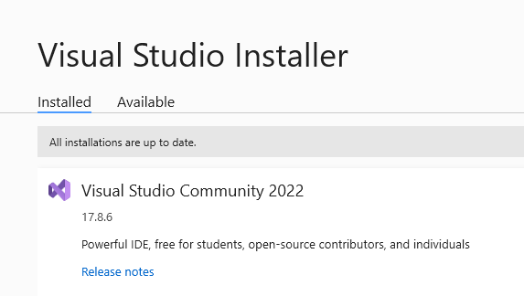
    - click `modify`
        - selecteer `.NET desktop development`
        > 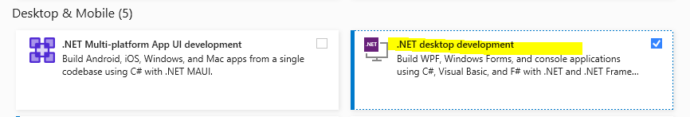

## windows forms programma maken

- open visual studio 2022
- start het maken van een nieuw project
    > 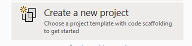
    - kies voor `windows forms C#`
        > 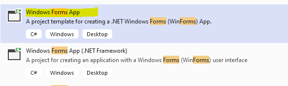

## Project wizard

Nu krijg je de `Project wizard`
- noem het project:
    - `FormsLerenKennen`
    > 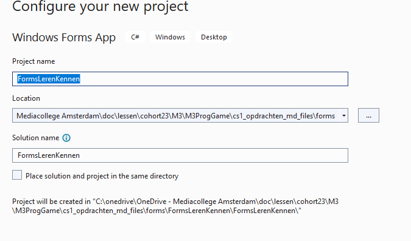
- click op `next`
    - op het volgende scherm laat je het framework staan
    > 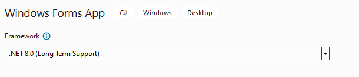

## Runnen

- nu heb je het forms project voor je:
    > 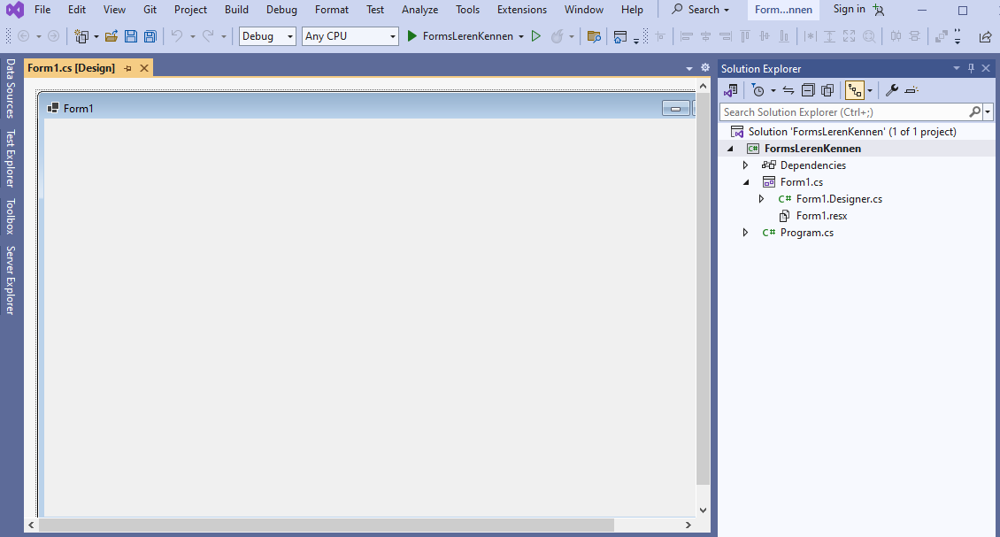
    - click nu de `toolbox` open
        > 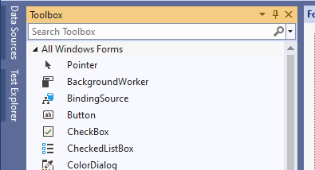
        > Zie je het niet aan de zijkant? gebruik het `view` menu boven in 

- click nu op `run`
    > 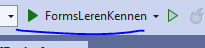
    - nu heb je je eerste window:
        > 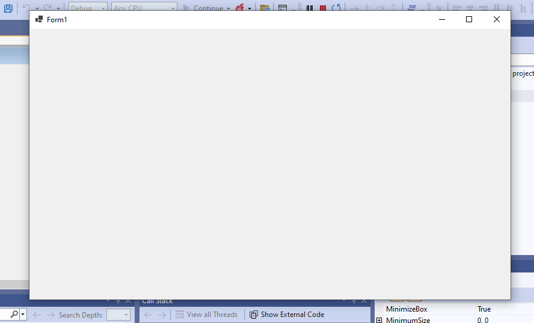
        - net een echte windows applicatie
    - stop de applicatie:
        - met de stop knop in visual studio `OF`
        - via het kruisje van de forms applicatie

## Controls

- gebruik nu de toolbox om wat controls op je form te zetten
    > hint sleep ze naar het formulier
    > 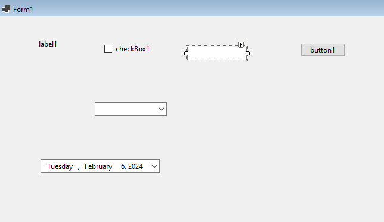

Natuurlijk is dit nog helemaal niets

## Properties window

- click nu op een control, een button 
    - druk op de `F4` keyboard key `OF`
    - rechter muis op de control, en kies `properties`
    > Nu zie je het properties window
    > 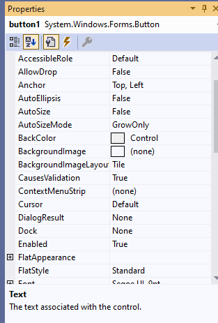
- pas nu de tekst aan (nette tekst graag)
    > 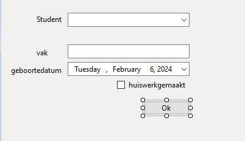

## ignore

- vergeet niet de `gitignore` file aan je project toe te voegen
    > 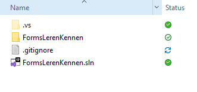
    - ZIE `04 git ignore.md`

## klaar
- commit alles naar je github