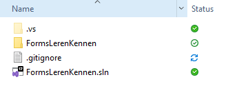

## Nieuwe forms applicatie

- open visual studio 2022
- maak een nieuw project:
    - `EventsProberen`

## Controls

- gebruik nu de toolbox om het volgende na te maken:
    > 

## Properties window

- `double click` de button
    > je komt in de code, en hebt een function gekregen:
    > 
- `double click` het text invoer veld
    > je komt weer in de code, en hebt een function gekregen:
    > 

## Werkende applicatie

- verander de code zodat het er zo uitziet:
    > 

## Test de applicatie

- `run` je applicatie
    - test of je iets kan toevoegen
    - test of het label veranderd als je typed
    > 

## zelf

- zorg er nu voor dat:
    - nadat je het item toegevoegd hebt (*na de click op de button*)
        - de tekst weer leeg wordt

## ignore

- vergeet niet de `gitignore` file aan je project toe te voegen
    > 
    - ZIE `04 git ignore.md`

## klaar
- commit alles naar je github