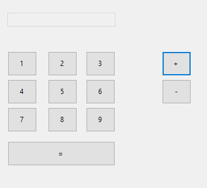
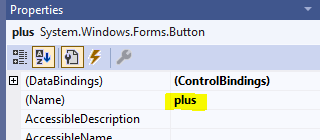
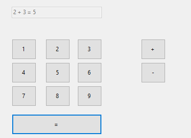

## Nieuwe forms applicatie

- open visual studio 2022
- maak een nieuw project:
    - `RekenMachine`

## Controls

- gebruik nu de toolbox om het volgende na te maken:
    > 

## goede namen

- zorg dat de knoppen een goede naam krijgen
    - ga naar de `properties` van een knop
        > 
        - pas de `naam` aan 
        > anders wordt je code `onleesbaar` voor jezelf en anderen

## Werkende applicatie

- zorg dat alle knoppen een goede naam krijgen
    - geef de knoppen `click events`

- zorg ervoor dat je een `plus` som kan maken:
    > 
    > `HINT`: gebruik je kennis van variabelen. 
    > zet deze boven in de `class`

## ignore

- vergeet niet de `gitignore` file aan je project toe te voegen
    > 
    - ZIE `04 git ignore.md`

## klaar
- commit alles naar je github